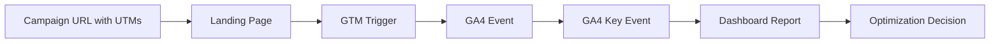

# GTM + GA4 Measurement Dashboard System

A portfolio-ready measurement planning project that shows how campaign traffic, UTM links, Google Tag Manager events, GA4 key events, conversion tracking QA, and reporting dashboards connect together.

This project is built as a practical **marketing measurement operations system** for lead-generation campaigns.

---

## Live Project Goal

Design a tracking and reporting system that helps a marketing team answer:

- Are campaign URLs tagged correctly with UTMs?
- Are traffic sources, mediums, campaigns, content, and keywords consistent?
- Which website actions should be tracked through GTM?
- Which GA4 events should become key events / conversions?
- Are required event parameters planned before launch?
- Is the measurement setup ready for dashboard reporting?
- What should be checked before campaign launch?

---

## Why This Project Matters

Paid campaigns often fail because tracking is not planned before launch. Common problems include missing UTMs, inconsistent campaign names, broken conversion events, unclear GA4 event taxonomy, duplicate event names, and no QA checklist.

This project solves that by creating a structured measurement plan before campaigns go live.

> **Core idea:** Campaign data is only useful when traffic tagging, website events, conversions, and dashboards are planned together.

---

## System Flow



---

## Repository Structure

| File / Folder | Purpose |
|---|---|
| `app.py` | Streamlit dashboard for UTM QA, GA4 event taxonomy, GTM trigger plan, and measurement readiness |
| `requirements.txt` | Python dependencies |
| `sample-data/campaign_urls.csv` | Sample campaign URLs with UTM parameters |
| `sample-data/ga4_event_taxonomy.csv` | GA4-style event taxonomy for a lead-generation website |
| `sample-data/gtm_trigger_plan.csv` | GTM trigger and tag planning sheet |
| `src/validate_measurement_plan.py` | Python script to validate UTMs, event planning, and QA readiness |
| `outputs/` | Generated QA output files after running validation |
| `docs/gtm-ga4-measurement-blueprint.md` | Step-by-step measurement blueprint |
| `docs/dashboard-spec.md` | Dashboard/reporting specification |
| `docs/qa-checklist.md` | Pre-launch GTM/GA4 QA checklist |

---

## Key Skills Demonstrated

| Category | Skills |
|---|---|
| GTM Planning | Tags, triggers, variables, event naming, conversion triggers |
| GA4 Planning | Event taxonomy, key events, parameters, funnel reporting |
| UTM Governance | Source, medium, campaign, content, term validation |
| Campaign QA | Pre-launch checks, tracking risks, measurement readiness scoring |
| Reporting | Dashboard structure, KPI cards, event readiness, QA issues |
| Data + Automation | Python, Pandas, Streamlit, Plotly, CSV validation pipeline |

---

## Sample Use Case

A business is running Google Ads, Meta Ads, LinkedIn Ads, and email campaigns for lead generation. The team wants to track:

- Page views
- Scroll depth
- CTA clicks
- Call clicks
- WhatsApp clicks
- Form starts
- Form submissions
- Thank-you page views
- Qualified leads
- Campaign source and medium

This project creates a measurement plan that helps identify tracking gaps before campaign launch.

---

## Run Locally

```bash
python -m pip install -r requirements.txt
python src/validate_measurement_plan.py
python -m streamlit run app.py
```

---

## Dashboard Sections

The Streamlit dashboard includes:

1. **Measurement Command Center** — readiness score, issue count, event coverage, key events
2. **UTM Governance** — campaign URL quality and naming consistency
3. **GA4 Event Taxonomy** — event names, funnel stages, required parameters, key events
4. **GTM Trigger Plan** — tags, triggers, trigger conditions, QA status
5. **QA Output** — issues that should be fixed before launch
6. **Portfolio Summary** — recruiter-friendly explanation of the project

---

## Public Portfolio Positioning

> Designed a GTM + GA4 measurement planning dashboard for lead-generation campaigns, including UTM governance, event taxonomy, key event mapping, GTM trigger planning, QA checks, and reporting-readiness scoring.

---

## Security Note

This project uses sample/demo data only.

Do not commit:

- Real GA4 measurement IDs
- GTM container IDs
- Google Ads account IDs
- Meta Ads account IDs
- API tokens
- Client CRM exports
- Service account JSON files
- `.env` files

---

## Status

| Area | Status |
|---|---|
| Repo setup | ✅ Done |
| Sample campaign URLs | ✅ Done |
| GA4 event taxonomy | ✅ Done |
| GTM trigger plan | ✅ Done |
| QA validation script | ✅ Done |
| Streamlit dashboard | ✅ Done |
| Live deployment | ⏳ Next |
| Portfolio website integration | ⏳ After deployment |
